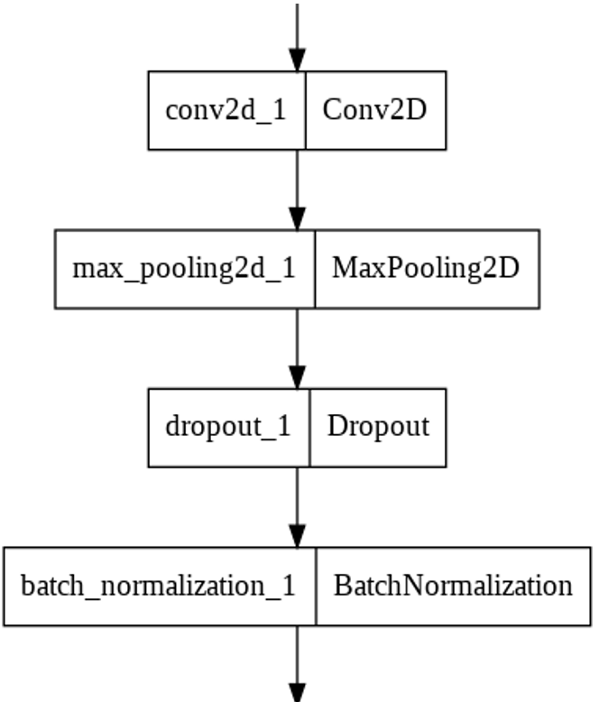
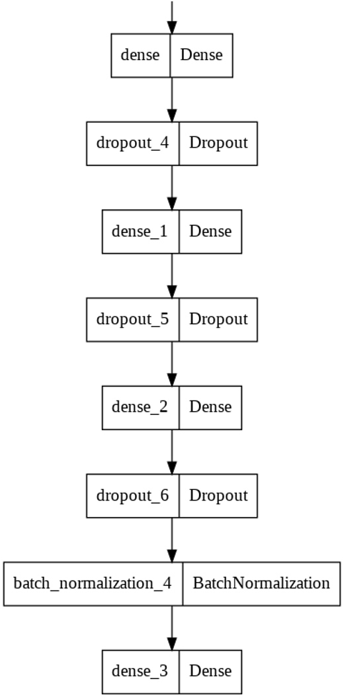
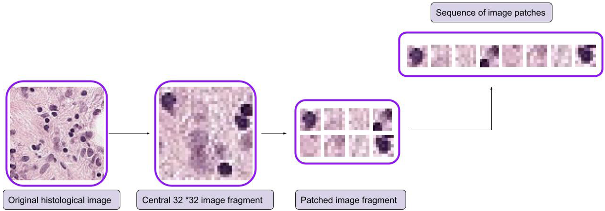
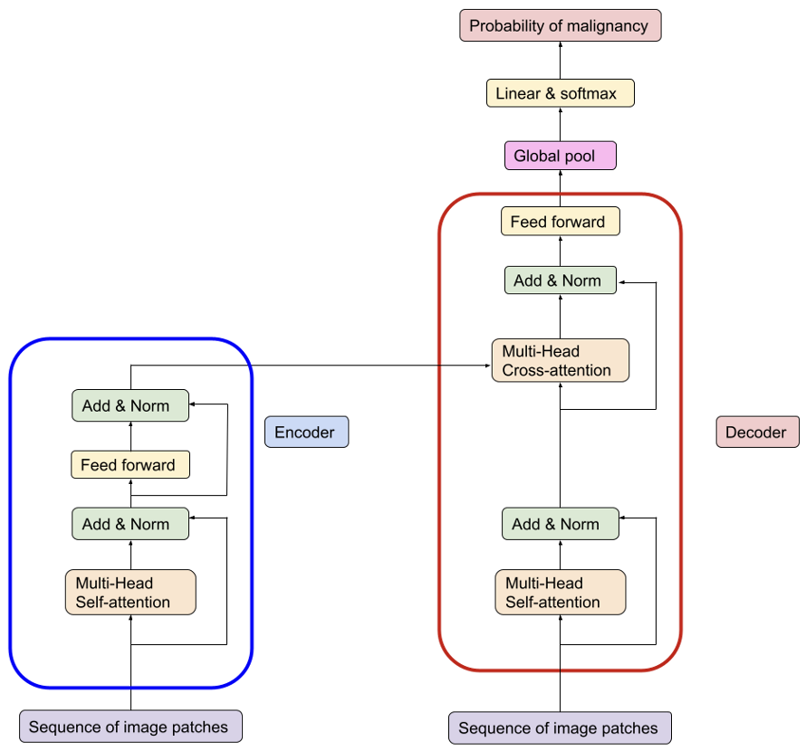
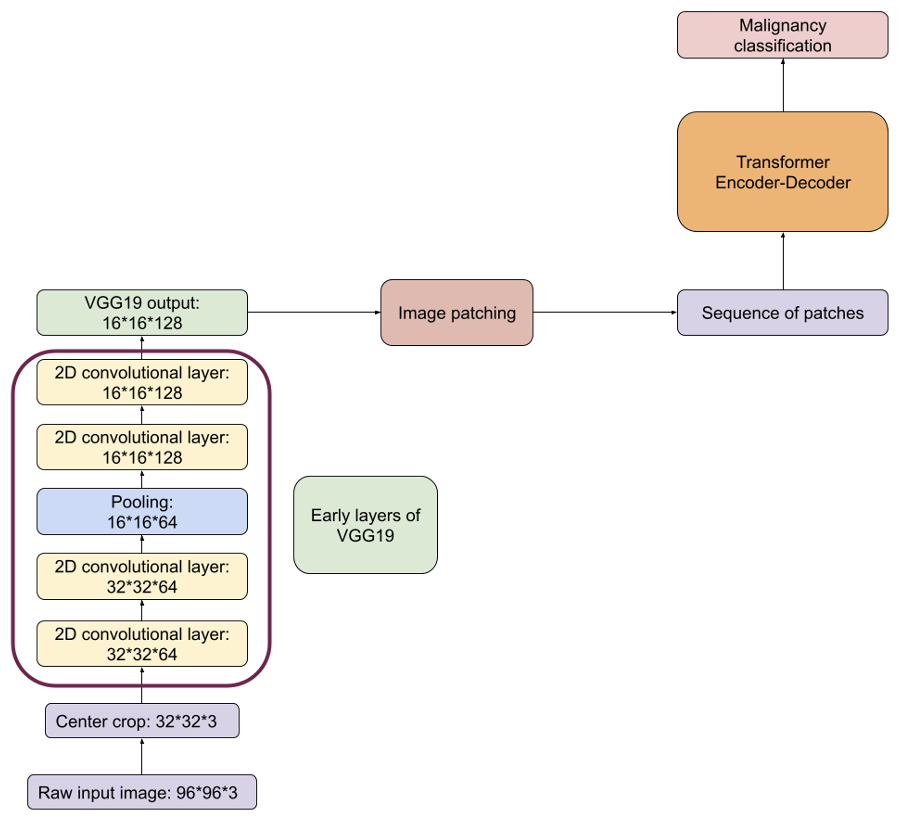

# Cancer Malignancy Classification

## Project Structure
In this repository, you will find the following relevant files:
1. Base.ipynb - this file contains the baseline 4-layer CNN model.
2. Inception.ipynb - here you will find code for using the Inception model.
3. Resnet.ipynb - here you will find code for using the the Resnet model.
4. Transformer_2.ipynb - this file contains the implementation of the vision transformer.
5. VGG.ipynb - this file contains the code for fine-tuning the VGG model.
6. VGG19_crop.ipynb - here you will find the code for using the VGG19 on the images with the applied central crop.
7. VGG19_decoder_crop - this file contains the implementation of the vision transformer added in tandem with the first 4 convolutional layers of VGG19.

## Usage
In order to successfully run the code in this repository, you will need to complete the following steps:

1. Clone the repository into your local machine.
2. Replace the code to supply the dataset.
3. Set up python virtual environment with the following commands:

```
python -m venv .venv
source ./.venv/bin/activate
pip install -r requirements.txt
```
4. After activating the environment and installing the dependencies, you can connect to the Jupyter Kernel and run the provided .ipynb notebooks.

# Results

## Introduction

Cancer is the second leading cause of death globally, taking the lives of over 8 million people every year. Tumor malignancy testing is a major part of cancer diagnosis since the treatment plans for benign and malignant tumors are vastly different. Therefore, high precision and high recall of tumor diagnosis are crucial for identifying proper treatment. In this project, apply neural networks with convolutional and transformer architectures to learn tumor representations and use them for classifying the tumor as either benign or malignant.

## Dataset preprocessing

We utilized and compared convolutional and transformer deep learning architectures for lymph node cancer detection. To train the neural networks, we used PatchCamelyon (PCam) dataset. The original PCam consists of 327.680 color images (96x96px) extracted from histopathologic scans of lymph node sections. Each image is annotated with a binary label indicating the presence of metastatic tissue. Positive label indicates that the center 32x32px region contains malignant tissue whereas the negative label means that the central 32x32 patch doesn’t contain a tumor. Due to the large size of the original dataset, we decided to use a small fraction of the data points. In the initial round of training, we used 6763 images sampled from PCam, with 90% of the dataset reserved for training, 5% for validation and 5% for testing. In the subsequent rounds of training, we increased the dataset size to 10000 and used 80% for training, 10% for validation, and 5% for testing.

For the training data, we utilized data preprocessing to reduce computational complexity. We re-scaled the numeric values of pixels in all datasets to lie between 0 and 1. Pixel value rescaling was done to reduce computation complexity for both forward and back propagation and reduce the risk of overflow. As for data augmentation, we applied random rotation between 0-45 degrees, horizontal, vertical flips, shifted image along X and Y axis by 30%, and finally, used zoom-in and zoom-out methods. The main reason to do these kind of data augmentations is to make our training dataset as rich as possible, in other words, to make the dataset more representative.

## Utilized models

We then proceeded to train multiple neural networks. First, we trained a custom network with multiple convolutional layers as the baseline. This model doesn’t use any pre-trained network and has 2.1 million trainable parameters. The architecture of the baseline network consists of 4 repeating blocks depicted in Figure 1. 



Figure 1. Custom CNN block.

First comes the convolutional layer which applies multiple convolutional filters to create a feature map that reveals whether the learned features are present in the input. Then comes a maximum pooling layer that down samples the feature map. This has an effect of making the feature map less sensitive to changes in position of the detected feature and introduces local transition invariance. Next comes the dropout layer which is used to perform model averaging and regularization by randomly dropping its constituent units and their connections. Finally, there is the batch normalization layer which performs re- centering and re-scaling of its inputs. This makes the subsequent computations faster and more numerically stable by reducing the chance of overflow. The output of the 4 CNN blocks is flattened to a single vector and then interpreted by the multilayered perceptron with 4 dense layers depicted in Figure 2. MLP accepts the flattened feature vector learned by the preceding CNN blocks and then makes the decision on whether the input image contains malignant tumor in the central patch. 



Figure 2. The multilayer perceptron block.

Apart from the custom CNN baseline, we utilized transfer learning and constructed 3 more networks which utilize VGG16 (14.8 million parameters), VGG19 (20.0 million parameters), InceptionV3 (21.8 million parameters) and ResNet-50 (23.5 million parameters) as base models initialized with weights from the ImageNet database(8). All layers of the pre-trained models were frozen. All 3 networks based on the pre-trained models take the output of the pre-trained models (excluding their fully connected layers), flatten it to a vector and feed it to the MLP in Figure 2. We chose to use the same MLP architecture for the upper prediction layer across all tested architectures to make them more comparable. This way, we can directly relate the differences in the overall accuracy to the network’s ability to extract useful features from images. 

We now discuss the transformer architecture and its applicability to vision. Multi-head attention allows the transformer to attend to multiple regions of the input sequence at once and thus compute a more complete learned representation of the input. It is the basis of the transformer. On a higher level, transformer consists of 2 key blocks: transformer encoder, and transformer decoder. Transformer encoder produces a representation of the input sequence by applying multi-head self-attention. Meanwhile, the decoder generates the result by first applying the multi-head self-attention to the output of the previous decoder layer, and then applying encoder-decoder attention which uses encoder final state output as keys and values, and the output of the previous decoder as queries. Multiple layers of encoder and decoder may be stacked together to learn deeper patterns from the input data. However, despite its merits, transformers are typically applied to sequential data, such as text, and not images. To make images compatible with the transformer architecture, we patched the 32*32 centrally cropped image into 196 patches, 5*5 pixels each. This procedure along with the model architecture are demonstrated below.



Figure 3. Image pre-processing for transformer encoder-decoder architecture. The image is first center-cropped to produce 32*32 fragment. The fragment is then patched into 5 * 5 pixel segments and the segments are reshaped into a sequence. Here we use an image from the utilized PCam dataset.



Figure 4.Transformer encoder-decoder for malignancy classification. The input image is patched and reshaped into a vector, then fed into the encoder. The output of the encoder is then fed into the decoder’s cross-attention. Finally, the result is pooled and fed into the softmax classifier.

Finally, we also developed a hybrid architecture which combines the benefits of convolutional neural networks for extracting useful features for the data and the benefits of transformer which can learn powerful representations of the input sequence thanks to the multi-head attention mechanism. To do this, we first center-cropped the image and then fed the output into VGG19. We then extracted the output of the fourth convolutional layer of VGG19 which contained 128 feature maps, each 16*16 pixels. The extracted feature maps were then patched into 512 patches, each 2*2 pixels. The patches were then reshaped into a single vector and then fed into the transformer encoder-decoder as is shown in the diagram below.



Figure 5. Combined CNN and transformer architectures. The feature map from the fourth convolutional layer is patched and reformed into a sequence, which is then fed into the transformer encoder-decoder

# Performance evaluation

We trained the baseline CNN model as well as the 4 pre-trained CNN models (VGG16, InceptionV3, ResNet50) for 10 epochs on the training set with pre-processed 6103 images in batches of 64 using Root Mean Squared propagation optimizer with the learning rate 0.001 and the binary cross entropy as the loss function. The  validation score is based on the validation set with 343 images and the final accuracy is evaluated on the test set with 317 images. The results of training are presented in Table 1.

Table 1. The results of training.

| Model          | Test set accuracy, % | MLP input vector dimension |
|----------------|----------------------|----------------------------|
| VGG16          | 83.5                 | 4608                       |
| InceptionV3    | 76.3                 | 2048                       |
| **Baseline model** | 72.6             | 18432                      |
| ResNet50       | 69.8                 | 18432                      |

Among all the tested architectures, VGG16 achieves the highest test set accuracy. This could be because we used a relatively small dataset and trained only the top MLP layers of the networks based on the pre-trained models. VGG16 supplied 4608-dimensional vector to the MLP, which worked best since it was neither too small, as in the case of InceptionV3, and neither too large, as in the case of the baseline and ResNet50. The second-best model was InceptionV3, whose 2048-dimensional vector meant fewer learnable parameters and thus lower accuracy. The baseline model scored higher than the pre-trained ResNet50 likely because it was entirely trainable and could better fit the dataset. ResNet50 had the lowest score, likely because its MLP input had a high dimension and because its convolutional layers were not trainable. The training history for all 4 models is presented below. Interestingly, in all networks with pre-trained models, the validation set accuracy eventually surpassed training set accuracy. This is a highly unexpected result. However, it can be explained by excessive data augmentation applied to training data which might have shifted the essential 32x32 central patch, resulting in lower accuracy.

In addition to the models above, we also trained a larger VGG19 with 19 layers. The model was trained for 50 epochs on the training set with pre-processed 8000 images in batches of 64 using the Adam optimizer with the learning rate 1e-4 and the categorical cross entropy as the loss function. The  validation score is based on the validation set with 1000 images and the final accuracy is evaluated on the test set with another 1000 images. We decided to evaluate the effect of central cropping on the model’s performance and thus we trained VGG19 with and without using central cropping. The results of training are presented in Table 2.


Table 2. Comparison of VGG19 performance with and without central cropping.

| Model                | Test set accuracy, % |
|----------------------|----------------------|
| VGG19 (no cropping)  | 58.5%                |
| VGG19 (with central cropping) | 74.1%        |

As evident from the results, central cropping drastically improves the performance of VGG19, likely because it allows the model to focus only on the key central patch which is the only part of the image used for malignancy label. 

Next, we trained the transformer encoder-decoder. Further, we wanted to compare the transformer encoder-decoder with the hybrid transformer + CNN architecture. Based on the results from VGG19, we applied central cropping to the original image in both cases to maximize the chance of higher accuracy. Both models were trained for 50 epochs on the training set with pre-processed 8000 images in batches of 64 using the Adam optimizer with the learning rate 1e-4 and the categorical cross entropy as the loss function. The  validation score is based on the validation set with 1000 images and the final accuracy is evaluated on the test set with another 1000 images. The results of training are presented in Table 3.

Table 3. Comparison transformer and hybrid transformer + CNN architecture.

| Model             | Test set accuracy, % |
|-------------------|----------------------|
| Transformer       | 74.8%                |
| CNN + Transformer | 77.9%                |

The results show a respectable performance of the simple transformer architecture, which only has 15 million parameters but performed better than some of the prior pre-trained CNN models. We can also see that the addition of the first 4 convolutional layers from VGG19 slightly improved the performance, highlighting the power and efficacy of convolutional architectures in extracting features from the image. The results also demonstrate that the CNN can be used in tandem with transformer encoder-decoder to reap the benefits of both the feature extraction by CNN and learning a strong representation of the data by the transformer.